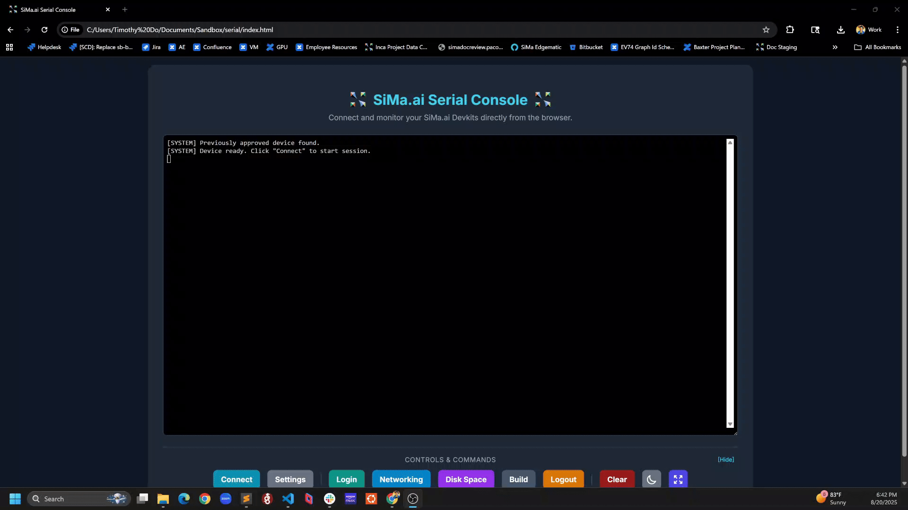

# SiMa.ai's Web Serial Console: Connect to Your SiMa.ai Devkits on the Web

* **Author:** [Timothy Do](mailto:timothy.do@sima.ai)

## Introduction: 
The SiMa.ai Web Serial Console is a Web App that allows users to connect to the SiMa.ai Devkits via a Chromium-based browser which supports the [Web Serial](https://developer.mozilla.org/en-US/docs/Web/API/Web_Serial_API) API. It is self contained, meaning the serial console can be run from a Chromium-based web browser without installing any other dependencies!

## Getting Started:
1. Clone the repo:  
<code>git clone git@bitbucket.org:sima-ai/apps-web-serial.git</code>

2. Host the Web App:  
<code>python app.py</code>

3. Go the Web App to Get Started:  
[https://127.0.0.1:5000](https://127.0.0.1:5000)

Alternatively, you can open <code>index.html</code> after cloning the repository if you want to run it locally on your machine.

## Usage: 
### 1. Browser Compatibility

Ensure you are using a modern, Chromium-based web browser that supports the Web Serial API.

* **Recommended:** Google Chrome, Microsoft Edge.

* **Not Supported:** Firefox, Safari.

### 2. Connect Your Devkit

Physically connect your SiMa.ai Devkit to your computer using a USB to Serial cable.

### 3. Launch the Console

Open the `index.html` file in your compatible browser, or navigate to the local server address if you are hosting it (e.g., `http://localhost:8000`).

### 4. Establish a Connection

* Click the **Connect** button located in the command palette at the bottom of the page.

* A browser pop-up will appear asking you to select a serial port. Choose the port corresponding to your SiMa.ai Devkit and click "Connect".

* The application will then automatically check if the device is at a login prompt. If it is, it will attempt to log in for you with the default credentials (`sima`/`edgeai`).

### 5. Using the Interface

Once connected, you can interact with the device in several ways:

* **Directly in the Terminal:** Type commands directly into the terminal window and press `Enter`.

* **Command Palette:** Use the buttons at the bottom for common actions:

  * **Connection:** `Connect`/`Disconnect`, and `Settings` (to change baud rate or flow control).

  * **Commands:** Quick buttons for `Login`, `Networking` (`ifconfig`), `Disk Space` (`df -h`), `Build` (`cat /etc/build`), and `Logout`.

  * **UI Controls:** `Clear` the terminal, toggle `Light/Dark Mode`, and enter `Fullscreen`.

* **Hide Controls:** Click the `[Hide]` button to collapse the command palette for a larger terminal view, especially useful in fullscreen mode.

### 6. Disconnecting

* Click the **Disconnect** button.

* The application will automatically send a `logout` command to the device before closing the connection to ensure a clean session exit.

## Support 
For any questions/feature requests regarding the tool, reach out to Timothy Do ([timothy.do@sima.ai](mailto:timothy.do@sima.ai))